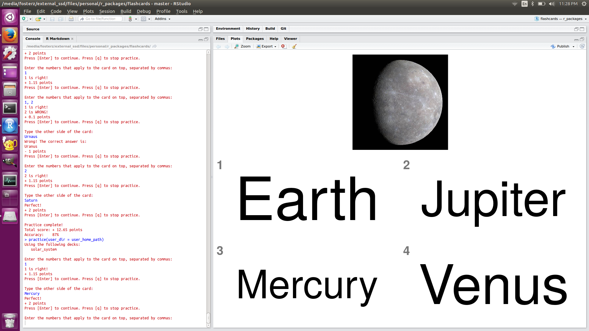

```{r echo=FALSE}
knitr::opts_chunk$set(
  warning = FALSE,
  message = FALSE,
  collapse = TRUE,
  comment = "#>"
)
```

# flashcards


[](https://travis-ci.org/zachary-foster/flashcards)
[](https://codecov.io/github/zachary-foster/flashcards?branch=master)




```{r child = 'vignettes/intro_vignette.Rmd'}
```

## Comments and contributions

We welcome comments, criticisms, and especially contributions!
GitHub issues are the preferred way to report bugs, ask questions, or request new features.
You can submit issues here:

https://github.com/zachary-foster/flashcards/issues
